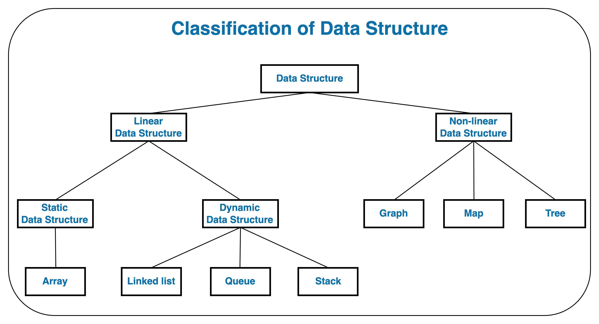

# Data Structures & Algorithms

> This repository is for structuring and organizing Data Structures and Algorithms knowledge.
> From the basics of DSA, it's going to expand to advanced DSA.

## Data Structure

### Classification of Data Structure

#### Linear Data Structure

> - Data Structure in which data elements are arranged sequentially or linearly.
> - If the element is attached to its previous and next one, it is the linear data structure.

##### Static Data Structure

> - Static Data Structure has a fixed memory size and structure in compile time.
> - The content of this structure can be modified without changing the memory space allocated to it.

- [Array](data-structure/linear-data-structure/static/array.md)

##### Dynamic Data Structure

> - Dynamic Data Structure has a variable size and structure at runtime.
> - It can be modified and resized during runtime.

- [Linked list](data-structure/linear-data-structure/dynamic/linked-list.md)
- [Queue](data-structure/linear-data-structure/dynamic/queue.md)
- [Stack](data-structure/linear-data-structure/dynamic/stack.md)

#### Non-linear Data Structure

> Data Structure in which data elements are not arranged sequentially or linearly.

- [Graph](data-structure/non-linear-data-structure/graph.md)
- [Map](data-structure/non-linear-data-structure/map.md)
- [Tree](data-structure/non-linear-data-structure/tree.md)

---

## Algorithm

---

## Reference

- [Data Structure-related useful links](resources/links.md)
